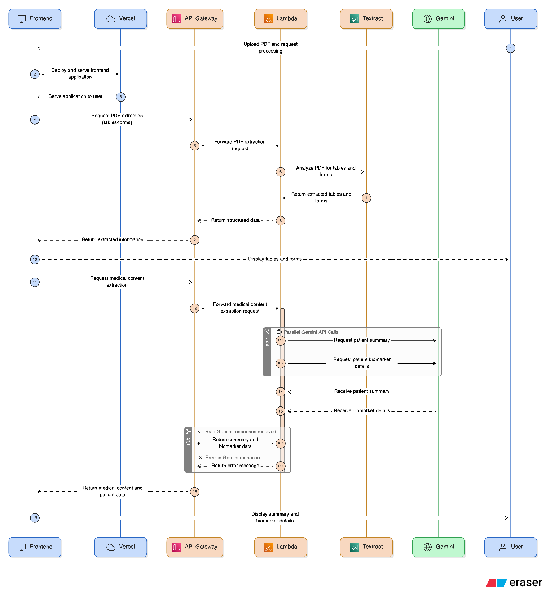

<h1 align="center">Health Report Analysis</h1>

### This is the solution for confluentia'25, PS-5

### check out here: [medicalreportanalysis.vercel.app](https://medicalreportanalysis.vercel.app)
### canva presentation link: [ppt-link](https://www.canva.com/design/DAGzlE9Iubw/6IprxPSgX8-z6D9giKgTNA/view?utm_content=DAGzlE9Iubw&utm_campaign=designshare&utm_medium=link2&utm_source=uniquelinks&utlId=hb02e05eddb)

## Features
- upload your medical report (either text or scanned copy)
- along with personal health data like age, weight, any recent symptons, gender.
- it then provides you with a brief summary about your health
- also a detailed table with all the biomakers provided in medical report, with precautions, and upcomming danger (if any).
- along with a chatbot powered by gemini, to ask medical related question (tunned to your medical report).

## Frontend
- react
- typescript
- tailwindcss (for styling)
- vite

## Backend
- AWS Lambda (for api endpoint logic)
- AWS API Gateway
- AWS Textract (for pdf to usefull text extraction)
- Gemini API (1.5 flash)
- Python

## How much AI is used to make this?
- for **backend** only aws textract pdf output to markdown logic was written by gemini.
- for **working flow diagram (below)** eraser.io ai is used.
- for **frontend** ui components is designed by chatgpt, gemini like (forms, report ui, chat bot, etc).

## Deployments
- frontend is deployed to vercel (takes <60ms once cached).
- backend is deployed on aws (warm containers takes <4 sec (pdf convert), and almost 12 sec for report analysis).
- custom github workflow is defined to push both lambdas to production envirnoment.

## Working Flow

## Team Members
- Aeshna Jain
- Vaishnavi Agarwal
- Vansh Gilhotra
- Tanishq Singh
